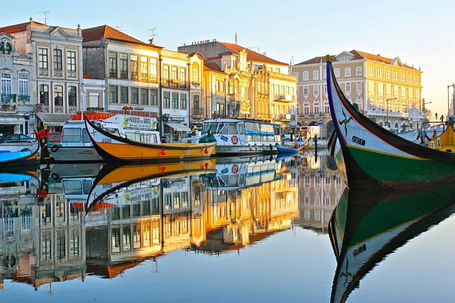
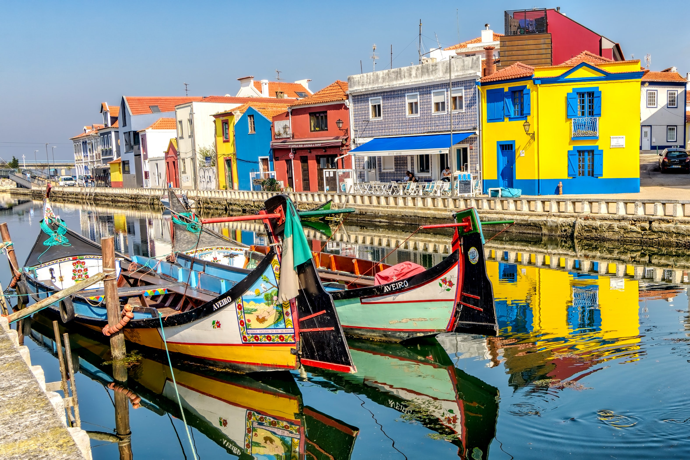
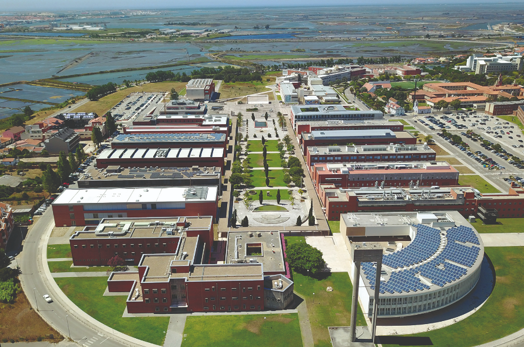

SEFM 2024 will take place at the University of Aveiro (UA) in Portugal.

<!-- 
- **The main conference** will take place in (...)
- **Sattelite workshops** on Monday and Tuesday are located in (...)
 -->

Aveiro is a coastal city located in the central region of Portugal, which is 5 minutes from the Atlantic beaches.
The Ria de Aveiro is a salt lake that follows the coastline for 45 km, providing a unique habitat for wildlife and is at the genesis of the city due to the production of salt. Aveiro is today a modern city, driven by the active academic life of its students.

Aveiro has today a very relevant tourist activity with numerous interesting things to visit and do. Tourist information can be found [here](https://www.visitportugal.com/en/content/visit-aveiro). You can also take a look at this
[video](https://youtu.be/0YPC6sfgj2I)
 with an overview of the places to visit in Aveiro, and at this short
[documentary](https://youtu.be/7H0QYbT2oMo)
 about the city's lifestyle.

## How to Get to Aveiro

    <!--   -->
       
    

   
 

Located between Lisbon and Porto, Aveiro is easily accessible by train from both cities. 
If you travel by plane, the most convenient airport is Francisco Sá Carneiro Airport (Porto). Passengers arriving at this airport should take the metro to Campanhã train station and then take a train to Aveiro. City trains run hourly and every day of the week.To travel from Lisbon Airport, passengers must take the metro at Estação do Oriente and then take a train to Aveiro (about 2.5 hours to travel 255 km).
To see timetables and buy tickets, go to
[here](https://www.cp.pt/passageiros/en).

<!--

## Travelling to Aveiro

### Travel by plane
...

### Travel by train
...

### Travel by car
...

## Aveiro
...

# Social Event & Banquet
... -->